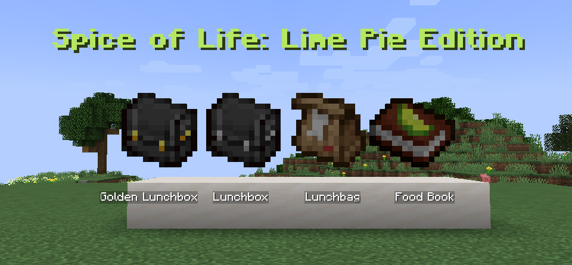
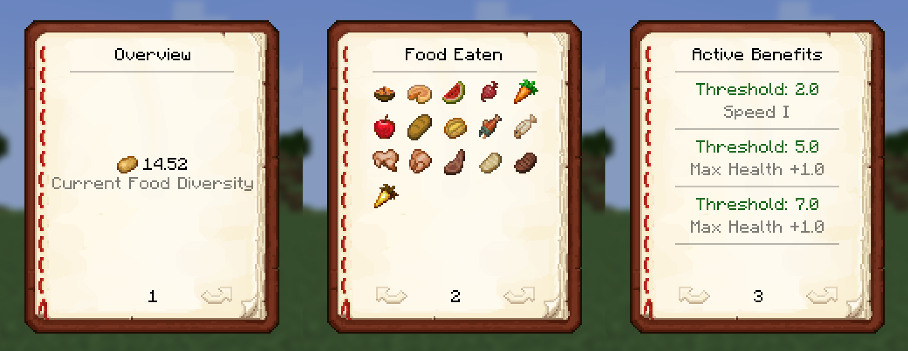
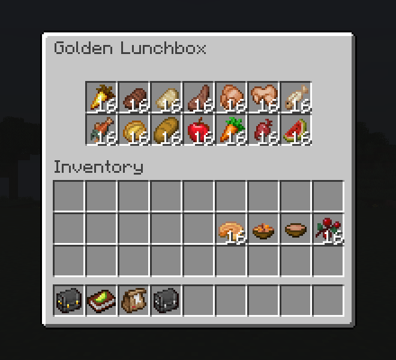

# Spice of Life: Lime Pie Edition

Eat varied foods to earn configurable bonuses, including extra maximum health. Repeating the same foods lowers your diversity.

A port of **[Spice of Life: Apple Pie Edition](https://github.com/txnimc/Spice-of-Life-Apple-Pie)** to a newer Minecraft version, with legacy bug fixes, performance optimizations, redrawn textures, and hardcoded text removed.

**Requirements:** NeoForge 21.1.251+

## How diversity works

Lime Pie rewards **maintaining a varied diet**. Your score reflects your recent meals, and bonuses follow your current score.

- **Recent history:** By default, only the last 32 recorded meals count. A food's contribution gradually fades as you eat more meals and disappears when it leaves that history.
- **Repeated foods:** Each food type contributes once. Eating it again refreshes its contribution, while other foods continue to fade.
- **Food value:** Contributions are weighted by hunger restored and saturation, so different foods can add different amounts to your score.
- **Ongoing bonuses:** Reaching a score threshold grants its bonuses; falling below it removes them. Keep rotating foods to maintain your benefits.

History length, decay, food weights, and bonuses are configurable.

**Alongside Carrot Edition:** Carrot Edition rewards the total number of different foods you have tried, while Lime Pie rewards variety in your recent diet. Their food tracking and bonuses are independent, so they are expected to coexist and their health bonuses to stack.

## Features

- **Food Book:** Check your diversity, recent foods, and benefits. Use the book or bind its shortcut in Controls.
- **Lunchbag, Lunchbox, and Golden Lunchbox:** Store food and automatically eat what helps your diversity most. Sneak and use to open.

## Credits and license

- **Development and port:** JIA · **Textures:** [gallium](https://github.com/9qtzq6zstf-dev)
- **Apple Pie Edition:** [Vice](https://github.com/txnimc/Spice-of-Life-Apple-Pie)
- **Predecessors:** [Potato Edition · Kevun1](https://github.com/Kevun1/Spice-of-Life-Potato-Edition) · [Carrot Edition · Cazsius & contributors](https://github.com/Cazsius/Spice-of-Life-Carrot-Edition)

License: [LGPL-2.1](LICENSE.txt)

---

## 简体中文

**生活调味料：青柠派版** — 饮食越丰富，就能获得额外生命值等可配置增益；反复吃同样的食物，多样性就会下降。

是《[苹果派版](https://github.com/txnimc/Spice-of-Life-Apple-Pie)》的高版本移植，修复遗留问题、优化性能、重绘贴图并去除文本硬编码。

**运行要求：** NeoForge 21.1.251+

### 多样性如何计算

青柠派版鼓励**持续保持丰富的饮食**。分数取决于近期进食，增益随当前分数变化。

- **近期记录：** 默认只计算最近 32 次有效进食。随着后续进食，某种食物的贡献会逐渐衰减，移出记录后不再计分。
- **重复食物：** 同种食物只计一份贡献。再次食用会刷新它的贡献，其他食物的贡献则继续衰减。
- **食物价值：** 贡献按食物恢复的饥饿值和饱和度加权，不同食物提供的分数可能不同。
- **持续增益：** 分数达到门槛时获得对应增益，跌破门槛则失去。想保持增益，就要持续轮换食物。

记录长度、衰减规则、食物权重和增益均可配置。

**与胡萝卜版搭配：** 胡萝卜版奖励累计尝试过的不同食物，青柠派版则奖励近期饮食的多样性。两者独立记录进食、施加增益，因此预计可以同时安装并叠加生命值加成。

### 功能

- **食物手册：** 查看饮食多样性、近期吃过的食物和当前增益。使用手册打开，也可在控制设置中绑定快捷键。
- **午餐袋 / 午餐盒 / 金午餐盒：** 储存食物，使用时自动选择最有助于提高多样性的食物。潜行使用可打开容器。
